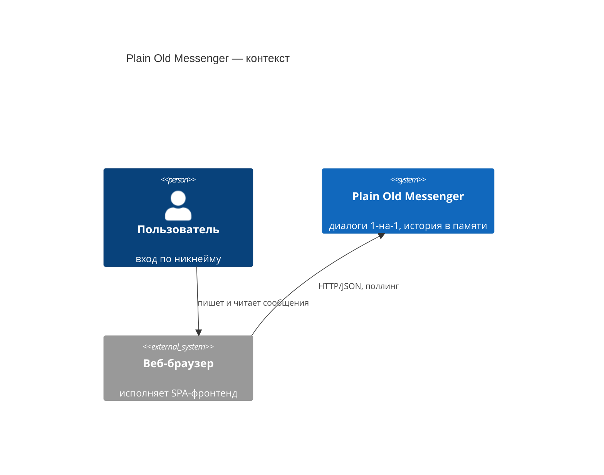

# C4 — Уровень 1: контекст системы

Диаграмма показывает систему Plain Old Messenger целиком: кто ею пользуется и с какими внешними системами она связана. Продуктовый контекст — в [PRD.md](../PRD.md), требования — в [SRS.md](../SRS.md).

## Пояснения

- **Пользователь** работает только с веб-интерфейсом; напрямую к API не обращается.
- **Веб-браузер** — единственная внешняя система: он исполняет фронтенд и передаёт HTTP-запросы бэкенду. Сервер уведомлений, email и прочие интеграции отсутствуют по дизайну (PRD, «Нецелевые требования»).
- Внутреннее устройство системы (фронтенд + бэкенд) раскрывает [диаграмма контейнеров](2-containers.md).
