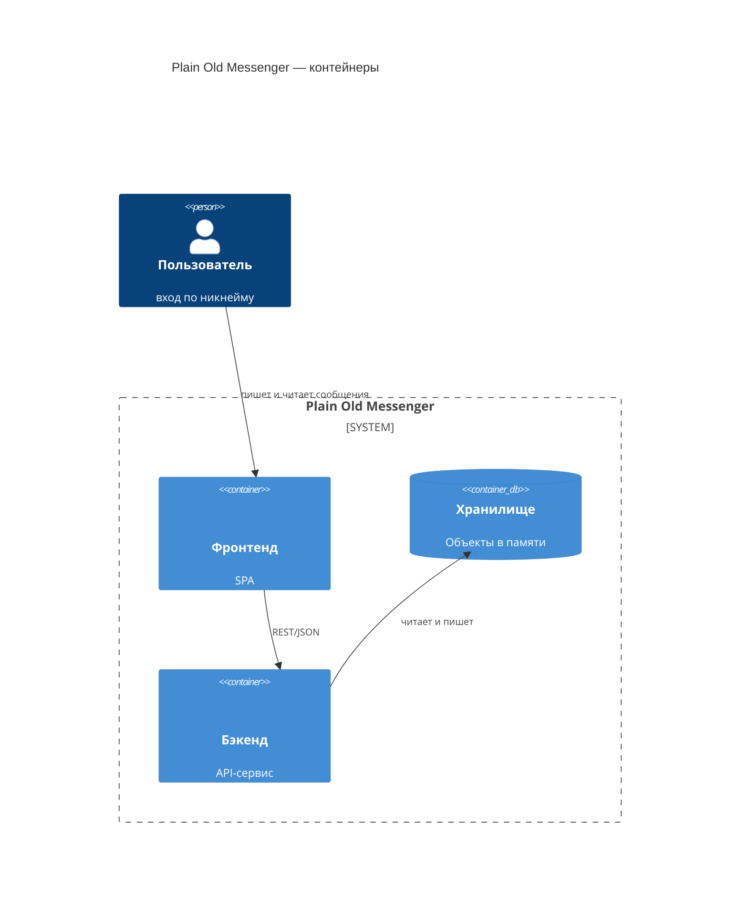

# C4 — Уровень 2: контейнеры

Диаграмма раскрывает внутреннее устройство системы: отдельные модули и хранилище данных. Внешний контекст — на [диаграмме контекста](1-context.md).

## API бэкенда

| Метод и маршрут | Назначение |
| --- | --- |
| `GET /api/dialogs` | список диалогов пользователя |
| `GET /api/messages` | история диалога; параметр `after` возвращает только новые сообщения (для поллинга) |
| `POST /api/messages` | отправка сообщения `{from, to, text}` |

## Пояснения

- **SPA-фронтенд** исполняется в браузере пользователя (сам браузер показан на диаграмме контекста); новые сообщения получает опросом `GET /api/messages` раз в 2 секунды.
- **API** — единый процесс ASP.NET Core (Minimal API); сам данных не хранит.
- **Хранилище** — не отдельный сервис, а объект `ChatService` внутри процесса API; показан отдельно, чтобы выделить место хранения данных и точку будущей замены на БД.
- В dev-режиме SPA запускается через Vite Dev Server (:5173), который проксирует `/api` на API (:5000); на диаграмме это не показано, чтобы не привязываться к dev-инфраструктуре.
