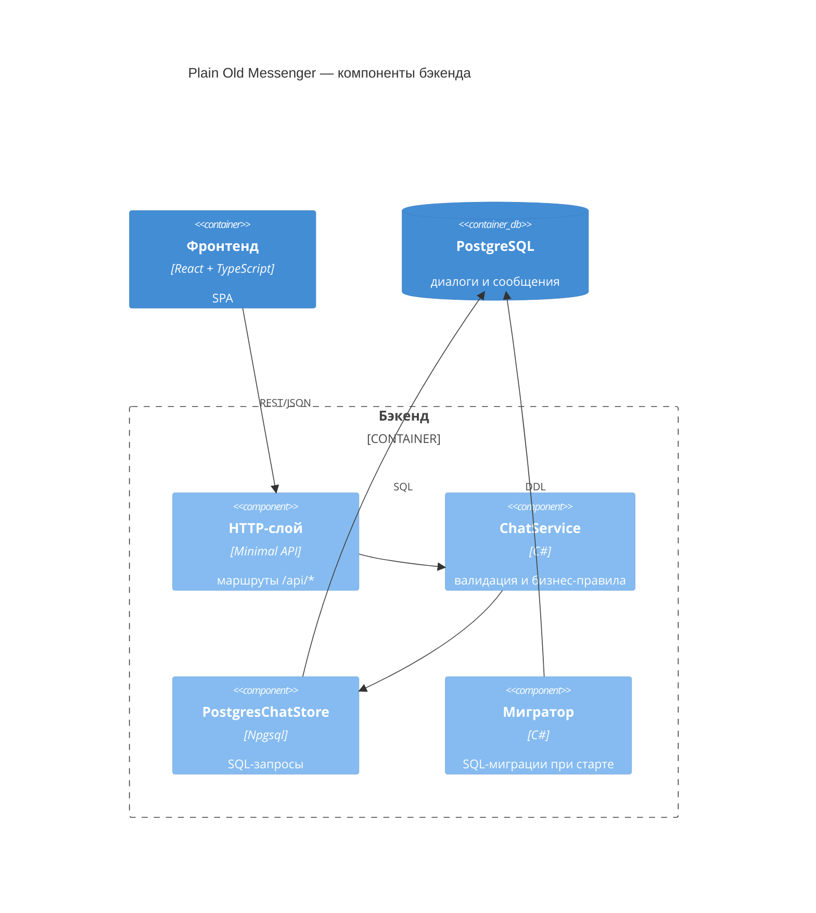

# C4 — Уровень 3: компоненты бэкенда

Диаграмма раскрывает внутреннее устройство контейнера «Бэкенд». Общий вид системы — на [диаграмме контейнеров](2-containers.md).

## Соответствие коду

| Компонент | Файл | Ответственность |
| --- | --- | --- |
| HTTP-слой | `src/ChatApi/Program.cs` | маршруты `GET /api/dialogs`, `GET /api/dialogs/{dialogId}/messages`, `POST /api/messages`; разбор запросов, ответы JSON, коды 400 и 404 |
| ChatService | `src/ChatApi/ChatService.cs` | проверка никнеймов (непустой, до 64) и текста (непустой, до 500), диалог с самим собой, логирование отправки |
| PostgresChatStore | `src/ChatApi/PostgresChatStore.cs` | весь SQL приложения: ленивое создание пользователей, поиск или создание диалога в транзакции, чтение истории и списка диалогов |
| Мигратор | `src/ChatApi/Migrator.cs` | ждёт готовности базы и применяет `Migrations/*.sql` до старта сервера |

## Пояснения

- HTTP-слой тонкий: только маршруты и преобразование «запрос → вызов сервиса → ответ».
- ChatService — фасад: не знает о SQL и Npgsql, делегирует хранение в PostgresChatStore.
- PostgresChatStore — единственное место, где живёт SQL; подключения берёт из общего `NpgsqlDataSource`.
- Мигратор запускается один раз при старте процесса, к обслуживанию запросов отношения не имеет.
- DTO (`Message`, `DialogSummary`, `SentMessage`, `MessageRequest`) — контракты запросов и ответов, отдельным компонентом не выделяются.
