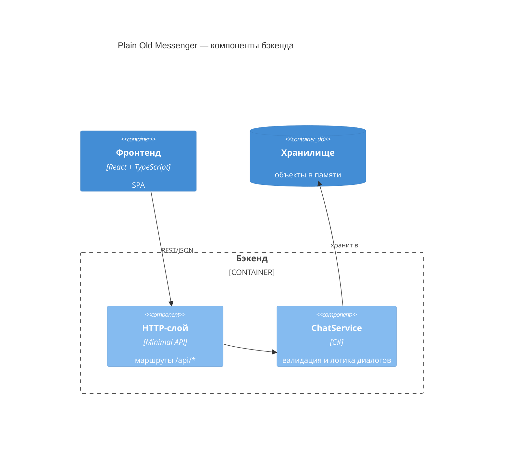

# C4 — Уровень 3: компоненты бэкенда

Диаграмма раскрывает внутреннее устройство контейнера «Бэкенд». Общий вид системы — на [диаграмме контейнеров](2-containers.md).

## Соответствие коду

| Компонент | Файл | Ответственность |
| --- | --- | --- |
| HTTP-слой | `src/ChatApi/Program.cs` | маршруты `GET /api/dialogs`, `GET /api/messages`, `POST /api/messages`; разбор запросов, ответы JSON и код 400 при ошибках валидации |
| ChatService | `src/ChatApi/ChatService.cs` | проверка никнеймов и текста (лимит 500), сквозная нумерация сообщений, хранение диалогов, потокобезопасность (`lock`) |

## Пояснения

- HTTP-слой тонкий: только маршруты и преобразование «запрос → вызов сервиса → ответ».
- DTO (`Message`, `DialogSummary`, `MessageRequest`) — контракты запросов и ответов, отдельным компонентом не выделяются.
- «Хранилище» повторяет контейнер с диаграммы 2: физически это поля `ChatService`, отдельного процесса нет.
