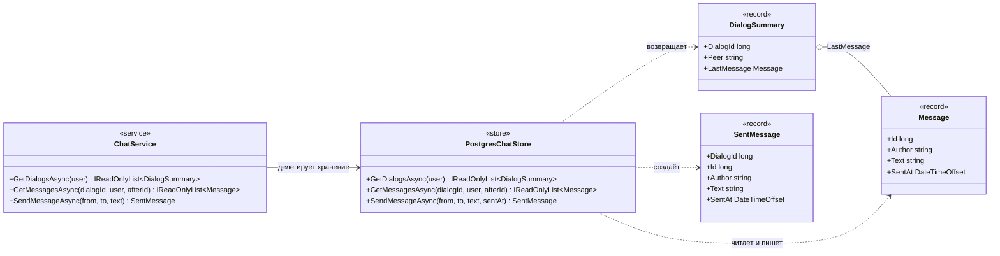

# C4 — Уровень 4: код бэкенда (классы)

Статическая структура слоя данных и его контракты. Динамика — на sequence-диаграммах [отправки](4-send-message.md) и [получения](4-receive-message.md) сообщений, состав компонентов — на [диаграмме компонентов](3-components.md).

## Пояснения

- Все методы асинхронные (`Task<T>`); на диаграмме возвращаемые значения указаны без `Task` для краткости.
- `ChatService` — фасад без состояния: валидация, бизнес-правила и логирование; хранение делегирует `PostgresChatStore`. `GetMessagesAsync` хранилища возвращает `null`, если пользователь не участник диалога, — сервис превращает это в `DialogNotFoundException` (ответ 404).
- `PostgresChatStore` получает подключения из `NpgsqlDataSource`; тексты SQL и транзакции — только здесь.
- `Message.Id` назначается базой (identity) и монотонно растёт: по нему работает поллинг (`after` = номер последнего полученного сообщения).
- Записи (record) — иммутабельные контракты ответов; `MessageRequest` — контракт тела POST-запроса, на диаграмме опущен.
