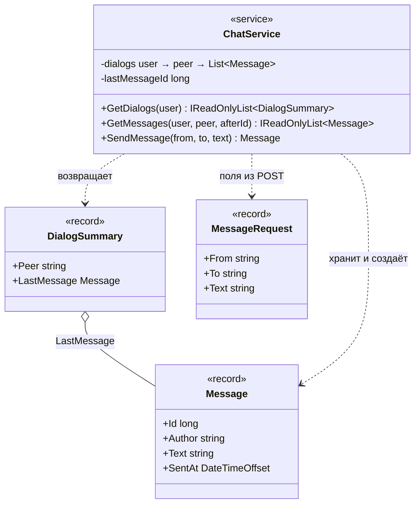

# C4 — Уровень 4: код бэкенда (классы)

Статическая структура ключевого компонента — `ChatService` — и его контракты. Динамика сценария — на [sequence-диаграмме](4-sequence.md), состав компонентов — на [диаграмме компонентов](3-components.md).

## Пояснения

- `ChatService` — singleton с доступом под `lock` (приватные детали на диаграмме опущены); каждое сообщение попадает в обе стороны диалога, поэтому `Id` один на оба списка.
- `Message.Id` — сквозная нумерация: по ней работает поллинг (`after` = номер последнего полученного сообщения).
- Записи (record) — иммутабельные контракты запросов и ответов; `DialogSummary` — проекция для списка диалогов.
