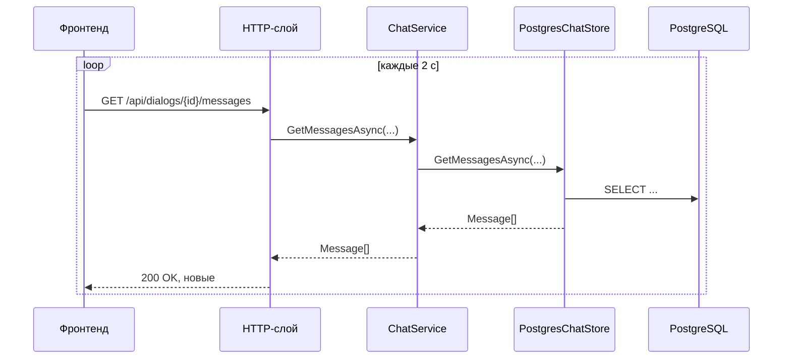

# C4 — Уровень 4: код бэкенда (получение сообщений)

Сценарий «получение сообщений» — поллинг открытого диалога. Статическая структура — на [диаграмме классов](4-code.md), отправка — на [sequence-диаграмме отправки](4-send-message.md).

## Пояснения

- `after` — `Id` последнего показанного сообщения; `0` — вся история при открытии диалога.
- История доступна только участникам диалога: чужой или несуществующий `dialogId` → `404 {error}`.
- Пустой список — обычный ответ, не ошибка: большинство опросов ничего не находят.
- Список диалогов обновляется отдельным поллингом `GET /api/dialogs` с тем же интервалом.
