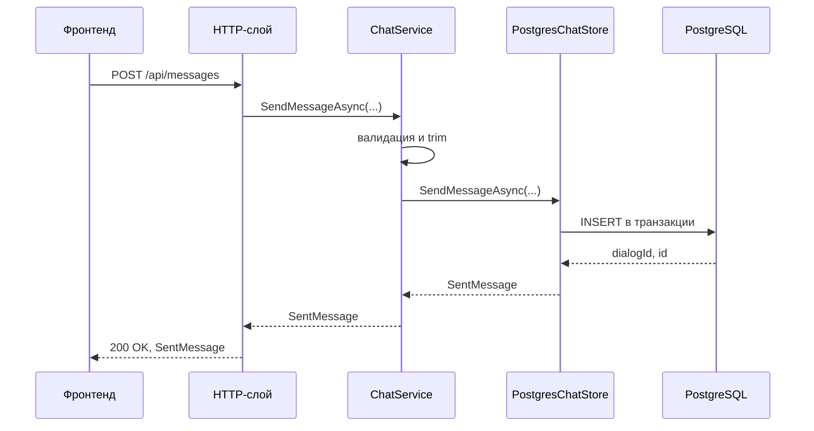

# C4 — Уровень 4: код бэкенда (отправка сообщения)

Сценарий «отправка сообщения» — динамика взаимодействия контейнеров и компонентов. Статическая структура — на [диаграмме классов](4-code.md), получение сообщений — на [sequence-диаграмме получения](4-receive-message.md).

## Пояснения

- Валидация в `ChatService`: никнеймы не пустые и не длиннее 64 символов, текст не пустой и не длиннее 500; нарушение — `ArgumentException` → эндпоинт отвечает `400 {error}`.
- Всё пишется одной транзакцией: незнакомые отправитель и получатель появляются в `users`, диалог находится по составу участников или создаётся вместе с первым сообщением. Advisory lock по паре участников не даёт параллельным «первым» сообщениям создать второй диалог.
- Ответ содержит `dialogId` — фронтенд использует его для истории и поллинга после первой отправки.
