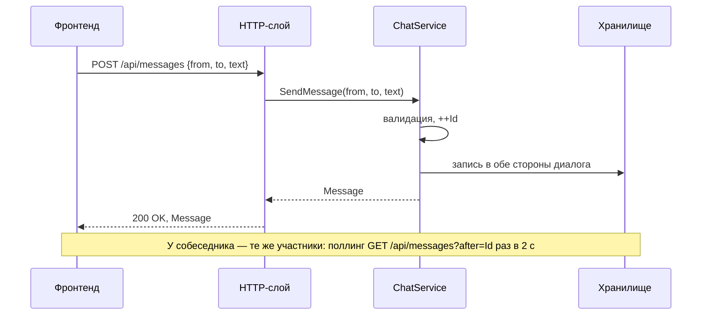

# C4 — Уровень 4: код бэкенда (последовательность)

Сценарий «отправка сообщения» — динамика взаимодействия контейнеров и компонентов. Статическая структура — на [диаграмме классов](4-code.md).

## Пояснения

- Валидация в `ChatService`: никнеймы не пустые, текст не пустой и не длиннее 500 символов; нарушение — `ArgumentException` → эндпоинт отвечает `400 {error}`.
- `Id` назначается один и используется в обеих копиях сообщения; диалог с собой (`from == to`) не дублирует запись.
- «Хранилище» здесь — внутренние структуры `ChatService`; отдельного процесса нет (см. [диаграмму контейнеров](2-containers.md)).
