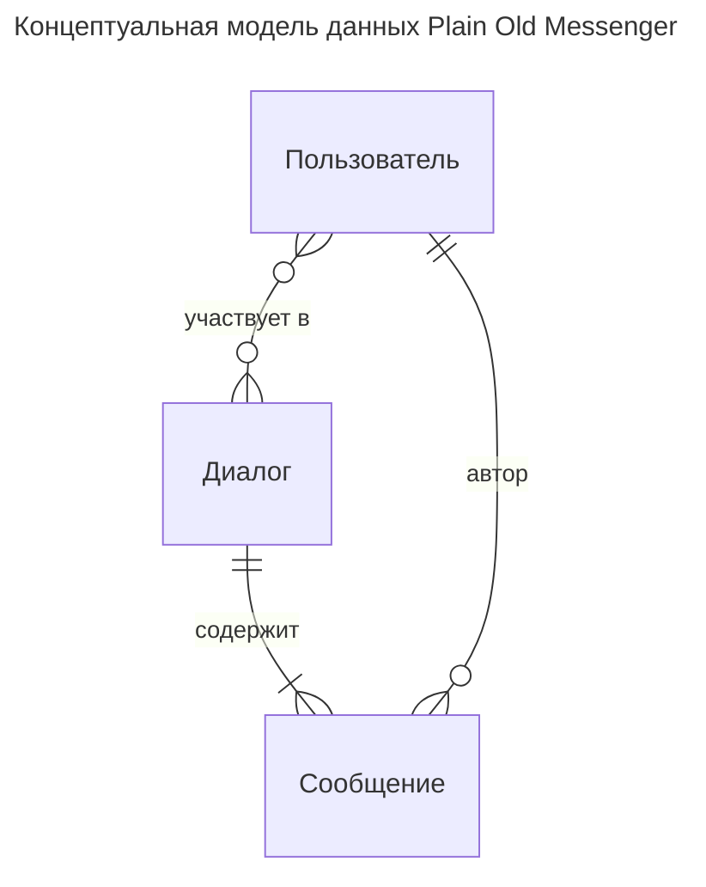

# ER-модель: концептуальный уровень

Предметная область с точки зрения данных, без атрибутов и типов — сущности и связи между ними. Состав сущностей выводится из кода `ChatService`: сегодня пользователи существуют только как никнеймы-строки, диалог — пара никнеймов, сообщение — запись с текстом и временем отправки. Логическая модель с атрибутами и ключами — в [2-logical.md](2-logical.md).

## Пояснения

- **Пользователь** — сегодня неявная сущность: в коде это просто никнейм-строка (`from`, `to`, `author`). Выделен в отдельную сущность, потому что на неё ссылается всё остальное, а в планах (PRD) — регистрация и пароли.
- **Диалог** — переписка двух равноправных пользователей: API обслуживает обе стороны симметрично, поэтому роли «владелец»/«собеседник» не выделяются; кто инициировал диалог, выводится как автор первого сообщения. Ограничение «ровно два участника, которые могут совпадать — диалог с самим собой (`from == to` в `SendMessage`)» в нотации не выражается и фиксируется здесь текстом.
- **Сообщение** — принадлежит ровно одному диалогу; автор — обязательно один из участников диалога (бизнес-ограничение, на диаграмме не выражается).
- Один диалог содержит одно или более сообщений (диалог возникает вместе с первым сообщением).
- В текущем коде каждое сообщение физически дублируется в обе стороны диалога с общим `Id`. На концептуальном уровне принято нормализованное представление: сообщение хранится один раз в одном диалоге — обе стороны читают его оттуда.
