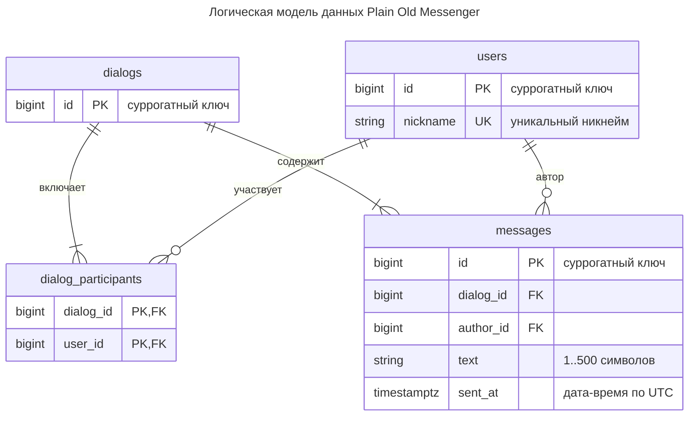

# ER-модель: логический уровень

Реляционная схема: сущности, атрибуты, ключи и связи. Типы указаны обобщённо, без привязки к СУБД; индексы и DDL останутся уровню физической модели. Состав сущностей и бизнес-ограничения — в [концептуальной модели](1-conceptual.md).

## Пояснения

### Отображение концептуальной модели

- `users` — неявные никнеймы-строки из кода становятся сущностью с суррогатным `id`; `nickname` остаётся уникальным идентификатором на уровне API. Суррогатный ключ стабилен при переименовании и оставляет место планам PRD (регистрация, пароли) без миграции ключей.
- Связь M:N «участвует в» отображена соединительной таблицей `dialog_participants` с составным первичным ключом `(dialog_id, user_id)` — он же исключает повтор участника в диалоге.
- `dialogs` — сущность из одного ключа: состав участников описывается только через `dialog_participants`. Схема не фиксирует число участников: правило «диалог — это один или два участника, один — диалог с самим собой» остаётся бизнес-ограничением текущей версии и контролируется приложением; групповые диалоги не потребуют миграции схемы.
- `messages` — нормализация вместо дублирования: сообщение хранится одной строкой с `dialog_id`, обе стороны читают его через него. В коде этому соответствуют два элемента списков с общим `Id`.

### Ключи и ограничения

- `messages.id` — суррогатный ключ. Генерация глобальная и монотонная (sequence/identity), поэтому id пригоден как курсор поллинга `after`: в пределах одного диалога значения возрастают, хотя и не подряд.
- Уникальность диалога: состав участников больше не защищён декларативным ограничением уникальности — СУБД не запретит второй диалог с тем же набором участников. Контроль уникальности набора — на уровне приложения.
- `author_id` должен ссылаться на участника диалога `dialog_id` — межтабличное ограничение FK/CHECK не выражается, контроль на уровне приложения.
- Диалог создаётся атомарно вместе с первыми участниками и первым сообщением; «минимум одно сообщение» FK не выражается, правило зафиксировано в концептуальной модели.
- `text` — от 1 до 500 символов (`MaxTextLength` в `ChatService`); trim и проверку непустоты выполняет приложение до сохранения.
- `sent_at` — дата-время по UTC (`DateTimeOffset.UtcNow`).

### Производные данные

- `DialogSummary {peer, lastMessage}` из `GET /api/dialogs` — проекция над схемой (собеседник + последнее сообщение диалога), не хранится.
- Индексы под запросы (участники по `user_id`, сообщения по `(dialog_id, id)`) — предмет физической модели.
