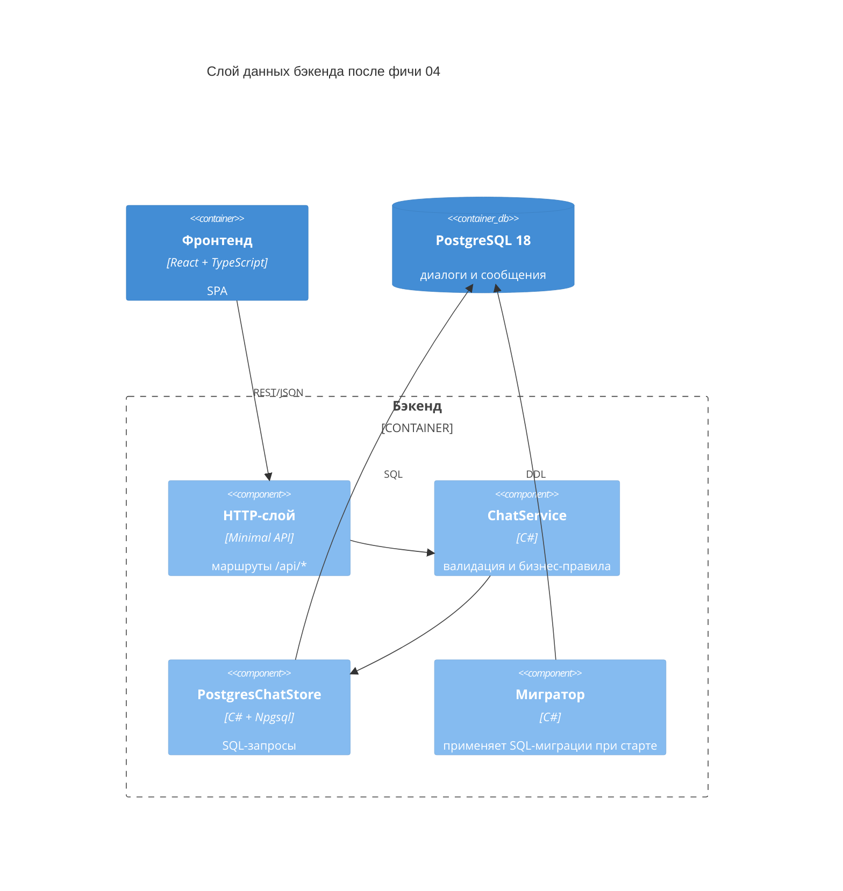

# SRS — Фича 04: хранение данных в PostgreSQL

Спецификация требований к фиче «постоянное хранение данных мессенджера в PostgreSQL 18». Заменяет пункт «Хранение в памяти процесса» из раздела 5 [SRS.md](../SRS.md); остальные требования SRS сохраняются. Продуктовый контекст — в [PRD.md](../PRD.md), модель данных — в [docs/data](../data/3-physical.sql), обзор архитектуры — в [docs/architecture](../architecture/2-containers.md).

## 1. Введение

Документ предназначен для разработчиков (студентов и преподавателей курса). Он фиксирует функциональные требования, требования к интерфейсам, инфраструктуре и ограничения реализации. Внутреннее устройство кода (конкретные имена методов, текст SQL) — решения разработчика.

## 2. Общее описание фичи

Данные мессенджера (пользователи, диалоги, сообщения) переезжают из памяти процесса в PostgreSQL 18. Состав изменений:

- **Инфраструктура** — Postgres 18 запускается в docker compose; схема базы применяется мигратором при старте API.
- **Слой данных** — в бэкенде появляется класс хранения на Npgsql; ChatService остаётся фасадом с валидацией и бизнес-правилами.
- **API** — чтение истории переходит на идентификатор диалога `dialogId`; фронтенд адаптируется.

Внешнее поведение системы для пользователя не меняется: вход по никнейму, диалоги, отправка сообщений, поллинг.

## 3. Функциональные требования

Приоритеты: **Must** — обязательно, **Should** — желательно.

| # | Требование | Приоритет |
| --- | --- | --- |
| F1 | `docker compose up -d` из корня репозитория поднимает Postgres 18 с именованным томом; данные переживают перезапуск контейнера и перезапуск API | Must |
| F2 | При старте API применяет все неприменённые SQL-миграции до начала обслуживания запросов; повторные старты не применяют их повторно | Must |
| F3 | Пользователи создаются лениво: отправитель и получатель появляются в `users` при первой отправке сообщения; повторные отправки не создают дубликатов | Must |
| F4 | Отправка сообщения находит существующий диалог пары участников или атомарно создаёт новый вместе с первым сообщением | Must |
| F5 | Параллельные «первые» сообщения одной паре пользователей не создают второй диалог | Must |
| F6 | Список диалогов пользователя содержит `dialogId`, ник собеседника и последнее сообщение | Must |
| F7 | История диалога возвращается по `dialogId` по возрастанию `id`; параметр `after` возвращает только сообщения с номерами больше указанного, `after=0` — всю историю | Must |
| F8 | Запрос истории диалога, которого нет или в котором пользователь не участвует, возвращает 404 | Must |
| F9 | После перезапуска процесса API диалоги и сообщения доступны (данные не теряются) | Must |
| F10 | Валидация входных данных возвращает 400 с текстом ошибки: пустой ник, ник длиннее 64 символов, пустой текст, текст длиннее 500 символов | Must |
| F11 | Диалог с самим собой работает и хранится с одним участником | Must |
| F12 | Список диалогов упорядочен по последнему сообщению: от недавних к старым | Should |
| F13 | Порт Postgres 5432 доступен с хоста для диагностики (`psql`) | Should |

Требования F1–F13 не отменяют [SRS.md](../SRS.md): сценарии F1–F8 основного SRS продолжают выполняться, меняется только способ хранения.

## 4. Требования к внешним интерфейсам

### 4.1. Маршруты REST API

| Метод и маршрут | Назначение | Успех | Ошибки |
| --- | --- | --- | --- |
| `GET /api/dialogs?user={ник}` | список диалогов пользователя | `200` — массив `DialogSummary` | `400` — некорректный ник |
| `POST /api/messages` | отправка сообщения; находит или создаёт диалог по паре участников | `200` — `SentMessage` | `400` — ошибки валидации |
| `GET /api/dialogs/{dialogId}/messages?user={ник}&after={id}` | история и поллинг диалога | `200` — массив `Message` | `400` — некорректные параметры, `404` — диалог не найден или пользователь не участник |

Формат обмена — JSON поверх HTTP, имена полей в camelCase, тело ошибок — `{"error": "текст"}` (в том числе для 404).

### 4.2. Схемы данных

```json
// DialogSummary
{ "dialogId": 3, "peer": "alice", "lastMessage": { "id": 105, "author": "alice", "text": "Привет", "sentAt": "2026-10-02T18:00:05Z" } }

// SentMessage — ответ POST /api/messages
{ "dialogId": 3, "id": 106, "author": "Bob", "text": "Привет!", "sentAt": "2026-10-02T18:00:07Z" }

// Message — элемент истории
{ "id": 106, "author": "Bob", "text": "Привет!", "sentAt": "2026-10-02T18:00:07Z" }
```

### 4.3. Правила валидации

Значения обрезаются от краёв пробелов (trim) до проверки и сохраняются обрезанными:

| Поле | Правило |
| --- | --- |
| `from`, `to`, `user` | непустые, не длиннее 64 символов; регистр значим («Bob» и «bob» — разные пользователи) |
| `text` | непустой, не длиннее 500 символов |
| `after` | целое число, `after ≥ 0` |
| `dialogId` | целое число в маршруте |

### 4.4. Фронтенд

- Открытый диалог идентифицируется `dialogId`; выбор из списка и поллинг истории используют его.
- Новый диалог до первого сообщения идентификатора не имеет: черновик держится на нике собеседника, первая отправка идёт через `POST /api/messages`, `dialogId` берётся из ответа.
- Интервал поллинга и поведение интерфейса не меняются.

## 5. Слой данных

Абстракция — «фасад + Postgres-хранилище», без интерфейсов и без ORM:



Обязанности фиксируются архитектурой:

- **ChatService** — публичный API слоя для HTTP-обработчиков: валидация входных значений, бизнес-правила, логирование. Не содержит SQL и не знает о Postgres.
- **PostgresChatStore** — все обращения к базе: тексты SQL, чтение и запись строк, транзакции. Единственная точка, где используется Npgsql.
- **NpgsqlDataSource** создаётся один раз при старте и раздаёт подключения; SQL-запросы параметризуются, конкатенация строк в SQL не допускается.
- Отправка сообщения выполняется в одной транзакции: upsert пользователей, поиск или создание диалога, вставка сообщения (F4, F5).
- Методы, выполняющие ввод-вывод, асинхронные (`Task`/`await`); блокировки в памяти (`lock`) уходят вместе с in-memory хранилищем — потокобезопасность обеспечивает СУБД.
- In-memory хранение (словари `ChatService`) удаляется; дублирующих реализаций хранилища не остаётся.

## 6. Инфраструктура и конфигурация

- Файл `compose.yaml` в корне репозитория: один сервис `db` на образе `postgres:18`, именованный том для данных, healthcheck (`pg_isready`), опубликованный порт 5432.
- Учебные параметры подключения задаются прямо в compose: база `chat`, пользователь `chat`, пароль `chat` (только для локальной разработки).
- Строка подключения лежит в `appsettings.json` (`ConnectionStrings:Chat`); переопределяется стандартными средствами конфигурации .NET (например, переменной окружения `ConnectionStrings__Chat`).
- API при старте ждёт готовности базы (повторные попытки подключения с ограничением по времени) и сообщает понятной ошибкой, если база недоступна.
- Бэкенд и фронтенд в compose не контейризируются: запускаются как раньше (`dotnet run`, `npm run dev`).

## 7. Миграции схемы

- SQL-файлы миграций лежат в проекте бэкенда (`src/ChatApi/Migrations/`), встраиваются в сборку как ресурсы и применяются по порядку имён файлов.
- Применённые версии фиксируются в служебной таблице `schema_migrations(version, applied_at)`.
- Первая миграция `0001-init.sql` воспроизводит схему [docs/data/3-physical.sql](../data/3-physical.sql); допустимые правки схемы — см. раздел 8.
- Готовые инструменты миграции (DbUp, Flyway) не используются; мигратор — небольшой собственный код.

## 8. Ограничения реализации

- **Без ORM:** EF Core, Dapper и подобные не применяются; для доступа к Postgres — только Npgsql (актуальная стабильная версия) и голый SQL.
- **Схема — как в [3-physical.sql](../data/3-physical.sql):** изменения допустимы только вместе с обоснованием в этом документе; правило «уникальность состава участников контролирует приложение» сохраняется (это оставляет путь к групповым диалогам без миграции схемы).
- **Бизнес-правила на приложении:** ровно два участника диалога (допускается один — диалог с собой), автор — участник диалога, диалог создаётся вместе с первым сообщением.
- **Время задаёт приложение:** `sent_at` записывается в UTC; `DEFAULT now()` в схеме — страховка.
- **Без over-engineering:** без интерфейса хранилища, без репозиториев по сущностям, без кэшей и слоёв «на вырост»; сторонние библиотеки — только Npgsql.
- **Тесты на этом этапе не добавляются.**

## 9. Нефункциональные требования

| # | Требование |
| --- | --- |
| N1 | Код бэкенда собирается `dotnet build` без предупреждений анализаторов; фронтенд проходит `npm run lint` и `npm run format:check` |
| N2 | README дополнен: требование Docker, команды запуска базы, остановки и сброса данных (`docker compose down -v`) |
| N3 | Документы актуализированы вместе с кодом: диаграммы контейнеров и компонентов в [docs/architecture](../architecture/2-containers.md), раздел 5 [SRS.md](../SRS.md), физическая схема в [docs/data](../data/3-physical.sql) |
| N4 | Код умещается в уме: файлы слоя данных читаются по отдельности за один присест |
| N5 | Простой сценарий проверки руками описан в README: отправить сообщение, перезапустить API и базу, убедиться, что история на месте |

## 10. Принятые решения

- **Абстракция слоя данных** — фасад `ChatService` + класс хранения `PostgresChatStore` без интерфейса: эндпоинты остаются тонкими, SQL изолирован, а подмена реализаций не нужна (тестов нет). Репозитории по сущностям и `IChatStore` отвергнуты как лишний слой для учебного проекта.
- **Ленивое создание пользователей** — отдельного эндпоинта входа/регистрации нет; пользователи появляются при первой отправке. UX не меняется.
- **`dialogId` в API** — чтение истории идёт по идентификатору диалога из схемы; отправка осталась одним маршрутом `POST /api/messages`, чтобы сохранить правило «диалог создаётся вместе с первым сообщением» и UX «новый диалог = указать ник собеседника».
- **Уникальность пары участников — в приложении**, декларативного ограничения в схеме нет (см. [2-logical.md](../data/2-logical.md)); способ защиты от гонки при параллельном создании (например, advisory lock по паре пользователей) — на усмотрении разработчика, требование зафиксировано в F5.
- **Мини-мигратор на старте** вместо `docker-entrypoint-initdb.d` (схема применяется к существующей базе, а не только к свежему тому) и вместо DbUp (сторонняя зависимость).
- **Compose только для Postgres** — бэкенд и фронтенд запускаются локально, как раньше.
- **404 вместо 403** для чужого диалога: не раскрывает существование диалогов с перебираемыми идентификаторами.
- **Регистр ников значим** — наследуется от физической схемы («Bob» и «bob» — разные пользователи).
